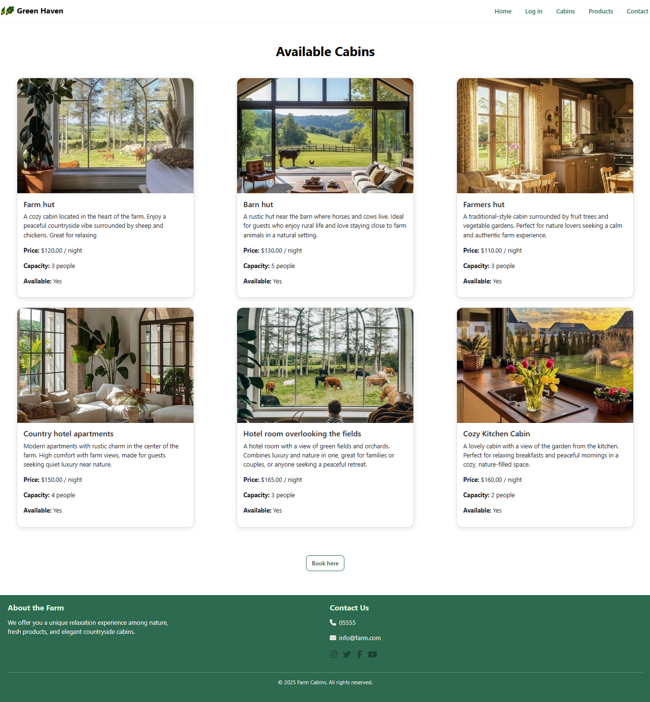

# 🌿 Farm Management System

A web-based farm management platform built with **ASP.NET Core MVC** that allows users to explore farm cabins and organic products, while administrators can manage cabins, products, and bookings through an admin dashboard.

The system aims to provide a simple platform for farm tourism and organic product management.


# 📌 Features

## Public Features

* View farm homepage
* Browse available cabins
* View farm activities
* Explore organic products
* View information about the farm

### Admin Dashboard

* Admin login
* Manage products (Add/Edit/Delete/View)
* Manage cabins (Add/Edit/Delete/View)
* Manage bookings (Create/Edit/Delete/View)
* Upload images for products and cabins


# 🧰 Technologies

* **Backend:** ASP.NET Core MVC (.NET 6), C#, Entity Framework Core, SQL Server
* **Frontend:** Razor Views, HTML5, CSS3, Bootstrap, JavaScript, Swiper.js


# 🖼 Images

Stored in `wwwroot/images` for cabins and products.


# ⚙️ Installation

1. Clone repo:
   `git clone https://github.com/RinadSalem /FarmManagement.git`
2. Open in Visual Studio 2022.
3. Update connection string in `FarmBookingDBContext.cs`:

   ```csharp
   Server=.;Database=FarmBookingDB;Trusted_Connection=True;
   ```
4. Run project (Ctrl + F5).


# 📈 Future Improvements

* User registration & login
* Password hashing
* Online booking & payment integration
* Email notifications


# 🖼 Screenshots
| Screenshot                                                                                |
| ----------------------------------------------------------------------------------------- |
| **Homepage**<br>                          |
| **Cabins Page**<br>                       |
| **Admin Dashboard**<br> |
| **Products Page**<br>                 |
